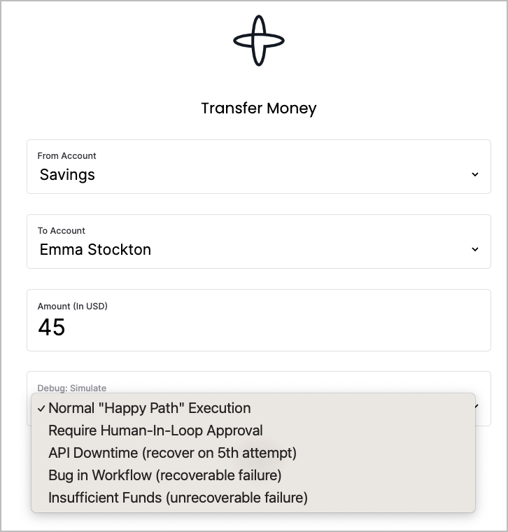

# Money Transfer Example

Demos various aspects of [Temporal](https://temporal.io) using the Java SDK.

A [Typescript SDK version](https://github.com/steveandroulakis/temporal-money-transfer) of this example is also available.



## Configuration

The sample is configured by default to connect to a [local Temporal Server](https://docs.temporal.io/cli#starting-the-temporal-server) running on localhost:7233.

To instead connect to Temporal Cloud, set the following environment variables, replacing them with your own Temporal Cloud credentials:

```bash
TEMPORAL_ADDRESS=testnamespace.sdvdw.tmprl.cloud:7233
TEMPORAL_NAMESPACE=testnamespace.sdvdw
TEMPORAL_CERT_PATH="/path/to/file.pem"
TEMPORAL_KEY_PATH="/path/to/file.key"
````

(optional) set a task queue name
```bash
export TEMPORAL_MONEYTRANSFER_TASKQUEUE="MoneyTransferJava"
```

## Run a Workflow

Note: Use a Java 18 SDK.

Start a worker:

```bash
ENCRYPT_PAYLOADS=true ./gradlew -q execute -PmainClass=io.temporal.samples.moneytransfer.AccountTransferWorker --console=plain
```

Run the money transfer web UI:

```bash
ENCRYPT_PAYLOADS=true ./gradlew -q execute -PmainClass=io.temporal.samples.moneytransfer.web.WebServer --console=plain
```
Then navigate to `http://localhost:7070/`

## Demo various failures and recoveries

A dropdown menu simulates the following scenarios

#### Happy Path
- The transfer will run to completion

#### Require Human-In-Loop Approval
The transfer will pause and wait for approval. If the user doesn't approve the transfer within a set time, the workflow will fail.

Approve a transfer using **Signals**
```bash
# where TRANSFER-EZF-249 is the workflowId
./gradlew -q execute -PmainClass=io.temporal.samples.moneytransfer.TransferApprover -Parg=TRANSFER-XXX-XXX
````

You can also do this through the `temporal` cli:
```bash
temporal workflow signal \
 --env prod \
 --query 'WorkflowId="TRANSFER-XXX-XXX"' \
 --name approveTransfer \
 --reason 'approving transfer'
```

Approve a transfer using **Updates**

You can do this through the `temporal` cli:
```bash
temporal workflow update \
 --env prod \
 --workflow-id TRANSFER-XXX-XXX \
 --name approveTransferUpdate
```

The workflow's Update function has a [validator](https://docs.temporal.io/dev-guide/java/features#validate-an-update). It will reject an Update if:
- The transfer isn't waiting for approval
- The transfer has already been approved

#### Simulate a Bug in the Workflow (recoverable failure)
Comment out the RuntimeException in the workflow code (`AccountTransferWorkflowImpl.java`) and restart the worker to fix the 'bug'.

#### Simulate API Downtime (recover on 5th attempt)
Will introduce artifical delays in the `withdraw` activity's API calls. This will cause activity retries. After 5 retries, the delay will be removed and the workflow will proceed.

#### Invalid Account (unrecoverable failure)
Introduces an unrecoverable failure in the `deposit` activity (invalid account). The workflow will fail after running compensation activities (`undoWithdraw`).

#### Schedule a recurring transfer
Creates a [Schedule](https://docs.temporal.io/workflows#schedule) that will run a set of workflows on a cadence.

Produces a schedule ID, which you can inspect in the Temporal UI's "Schedules" menu.

## Advanced: Reset workflows

#### List failed workflows
temporal workflow list --env prod -q 'ExecutionStatus="Failed" OR ExecutionStatus="Terminated"'

## Enable Encryption

Remove the `ENCRYPT_PAYLOADS` variable in each command to run without encryption.

You can decrypt these payloads in Temporal Cloud's UI/cli using the codec server: `https://codec.tmprl-demo.cloud` ([source](https://github.com/steveandroulakis/temporal-codec-server)). Ensure you switch on "Pass the user access token with your endpoint". Note: The codec server is only compatible with workflows running in Temporal Cloud.

## Test for non-determinism errors (Replay)

Example command (run from root directory)
```bash
./gradlew -q execute -PmainClass=io.temporal.samples.moneytransfer.Replayer \
 -Parg=../workflowHistories/human-in-loop-approved.json
```

Introduce a non-determinism error by adding Workflow.Sleep or re-arranging activity executions:
```bash
 error=io.temporal.worker.NonDeterministicException:
  Failure handling event 15 of type 'EVENT_TYPE_ACTIVITY_TASK_SCHEDULED' during replay.
  No command scheduled that corresponds to event_id: 15
```
Note: This replayer doesn't work with histories using ENCRYPT_PAYLOADS=true
