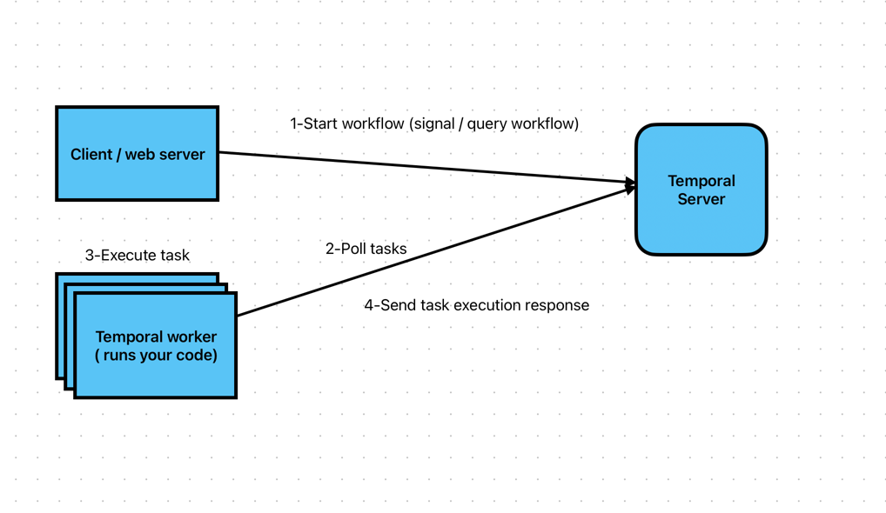

# Money Transfer Example





### Temporal server

```bash

docker compose down --remove-orphans && docker volume prune -f


startDockerCompose

```

### Web server

```bash
ENCRYPT_PAYLOADS=false ./gradlew -q execute -PmainClass=io.temporal.samples.moneytransfer.web.WebServer --console=plain
```


### Worker

```bash
ENCRYPT_PAYLOADS=false ./gradlew -q execute -PmainClass=io.temporal.samples.moneytransfer.AccountTransferWorker --console=plain
```


###
```bash
temporal operator search-attribute create --namespace default --type Keyword --name Step
```


```bash
# where TRANSFER-EZF-249 is the workflowId
./gradlew -q execute -PmainClass=io.temporal.samples.moneytransfer.TransferApprover -Parg=TRANSFER-XXX-XXX
````

You can also do this through the `temporal` cli:
```bash
temporal workflow signal \
 --env prod \
 --query 'WorkflowId="TRANSFER-SLC-160"' \
 --name approveTransfer \
 --reason 'approving transfer'
```